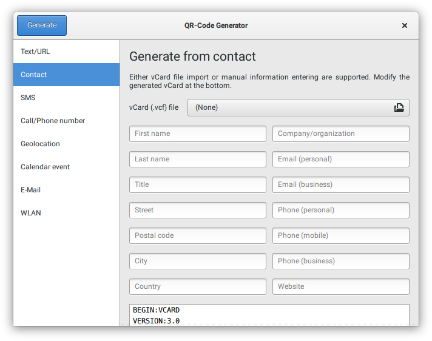
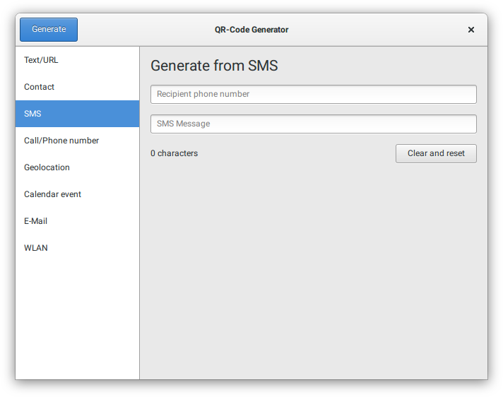
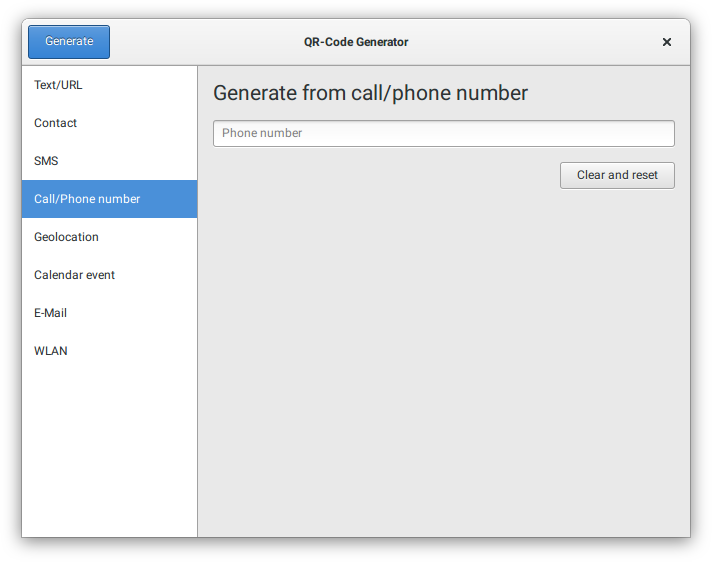
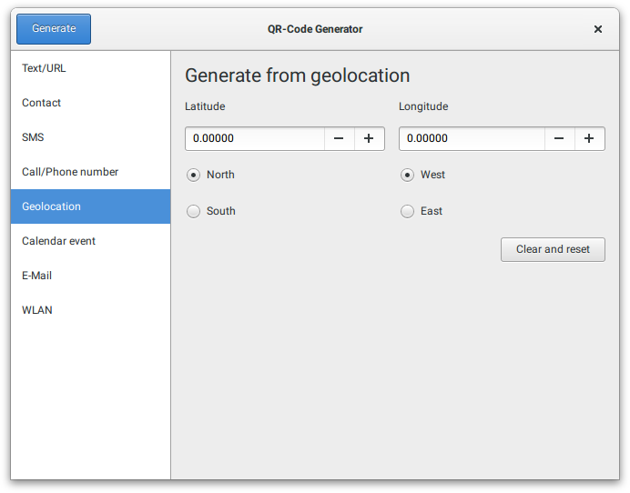
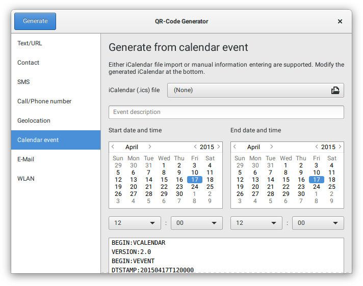
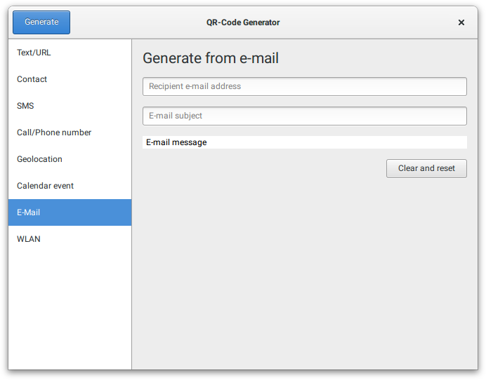
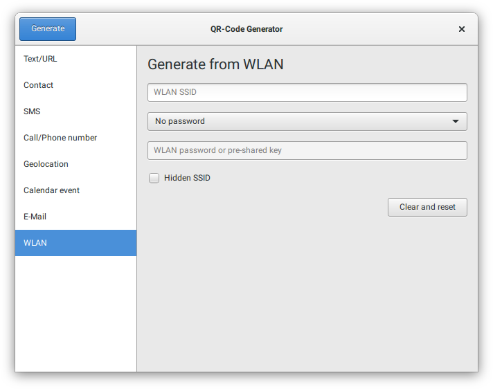
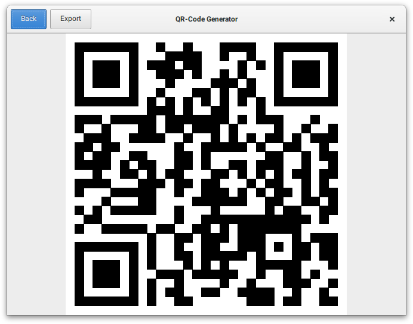

# QR-Code generator

Simple graphical user interface for generating QR-Codes.

## Features

* Simple and clean UI
* QR code generation for many input sources (listed below)
* vCard and iCalendar file import
* Export QR code as PNG file with changeable size
* Editable generated contact and calendar QR code data

## Supported input sources

* Text
* URL
* Contact (name, address, company, email, phone number, website)
* SMS (recipient, message)
* Call/Phone number
* Geolocation (latitude, longitude)
* Calendar event (date, time, description)
* E-Mail (recipient, message)
* WLAN access information (SSID, passphrase, encryption, etc.)

## Screenshots

### Text/URL

### Contact

### SMS

### Call/Phone number

### Geolocation

### Calendar

### E-Mail

### WLAN

### Generated QR-Code

