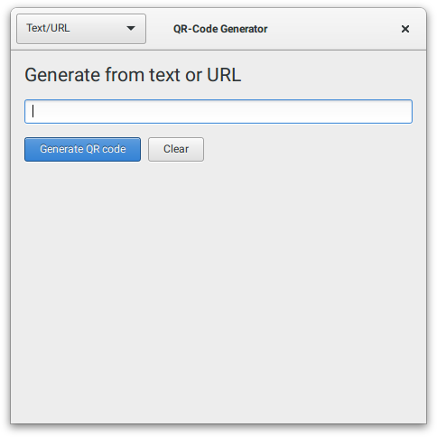
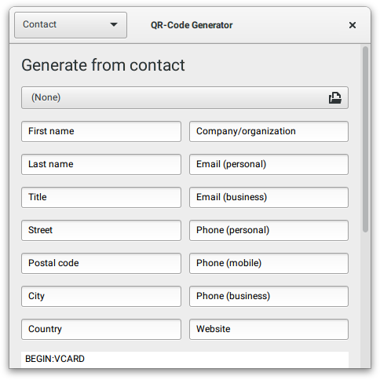
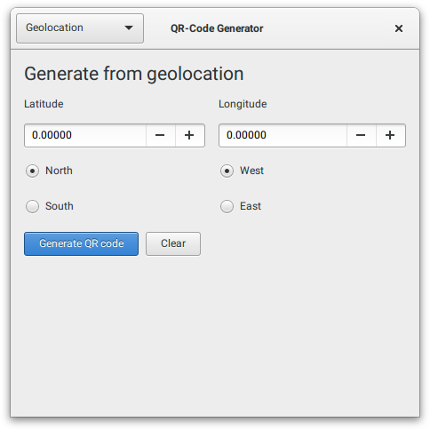
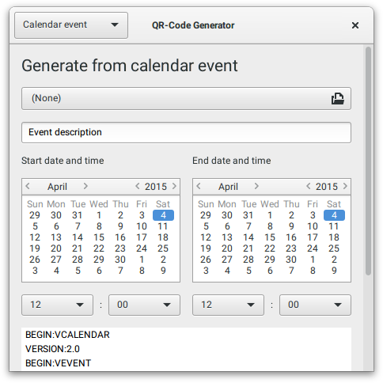
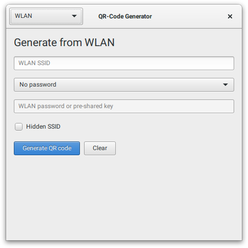
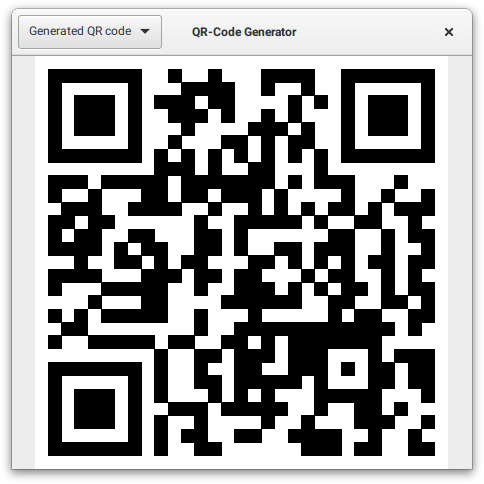

# QR-Code generator

Simple graphical user interface for generating QR-Codes

## Support for

* Text
* URL
* Contact
* SMS
* Call/Phone number
* Geolocation
* Calendar event
* E-Mail
* WLAN access

## Screenshots

